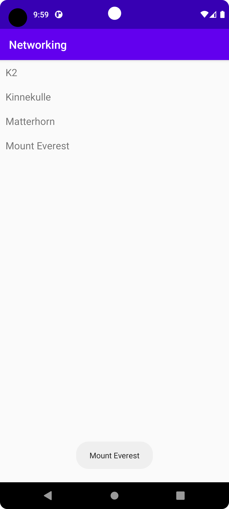

# Rapport

Forked the app on Github.
Added a RecyclerView Widget to my layout and created a new LayoutFile recyclerview_item to represent a list item.

Created a new Java-class RecyclerViewItem to represent the item..

Created a recyclerviewadapter class,Copied in the code example from the course-site.
Declared and initialized an adapter in my mainActivity class.
Added an ArrayList<Mountain> called mountainList 

Activated internet-acces.

Used the URL Json to get the data for the ArrayList.
Most of my time on this project have been to identify issues. 
First my 'getItemCount' was null in RecyclerViewAdapter and I had no idea why.
After som changes in MainActivity there were other issues. 
Found out there was a typo in my URL. 


Below code updated the RecycleView list with information from the Json url.

```
    public void onPostExecute(String json) {
        Log.d("MainActivity", json);
        Gson gson = new Gson();
        Type type = new TypeToken<List<Mountain>>() {
        }.getType();
        mountainList = gson.fromJson(json, type);


        adapter.addData(mountainList);

        adapter.notifyDataSetChanged();
    }
```

Below image shows a list of mountains gathered from the url.
When clicked the name appears in the bottom of the screen.



Läs gärna:

- Boulos, M.N.K., Warren, J., Gong, J. & Yue, P. (2010) Web GIS in practice VIII: HTML5 and the canvas element for interactive online mapping. International journal of health geographics 9, 14. Shin, Y. &
- Wunsche, B.C. (2013) A smartphone-based golf simulation exercise game for supporting arthritis patients. 2013 28th International Conference of Image and Vision Computing New Zealand (IVCNZ), IEEE, pp. 459–464.
- Wohlin, C., Runeson, P., Höst, M., Ohlsson, M.C., Regnell, B., Wesslén, A. (2012) Experimentation in Software Engineering, Berlin, Heidelberg: Springer Berlin Heidelberg.
